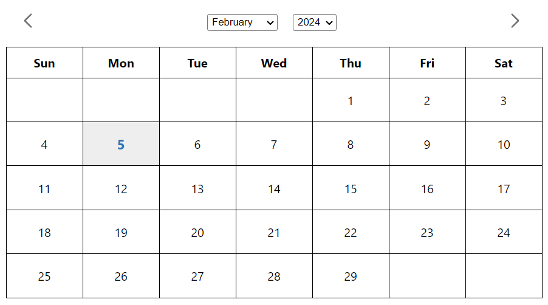

# Calendar App

This calendar app provides a user-friendly interface to view, select, and manage dates. Users can navigate through months and years, add or subtract months, and view/add data for each date.

## Features

- Select a date from the calendar.
- Navigate through months and years using dropdowns.
- Add or subtract months to view different time periods.
- Add data for each date.

## Tech Stack
- React JS (Typescrpit)
- HTML5, CSS3 (Styled Component)
- Library Used:
    - Moment.js
    - Styled Component
    - Typescrpit

## Key Features

- **User-Friendly Interface:** Intuitive design for easy navigation and interaction.
- **Dynamic Date Handling:** Utilizes Moment.js for robust date manipulation and formatting.
- **Type-Safe Development:** Leverages TypeScript to catch errors during development.
- **Styled Components:** Encapsulated and reusable styles for a maintainable codebase.
- **Data Management:** Easily add and retrieve data associated with specific dates.

## Get Started
1. Clone this repository: `git clone https://github.com/Jaganath-MSJ/CalendarSimple.git`
2. Navigate to the project directory: `cd CalendarSimple`
3. Install dependencies: `npm install`
4. Start frontend: `npm start`
5. Open the app in your browser: `http://localhost:3000`

## Demo:
For a live demonstration, you can visit [Demo Link](http://calendarsimple.netlify.app).

## Contact:
Feel free to reach out to me via email at [jagan.msjc@gmail.com](mailto:jagan.msjc@gmail.com) or connect on [LinkedIn](https://www.linkedin.com/in/jaganathms).

## Thanks To
[Netlify](https://www.netlify.com)
